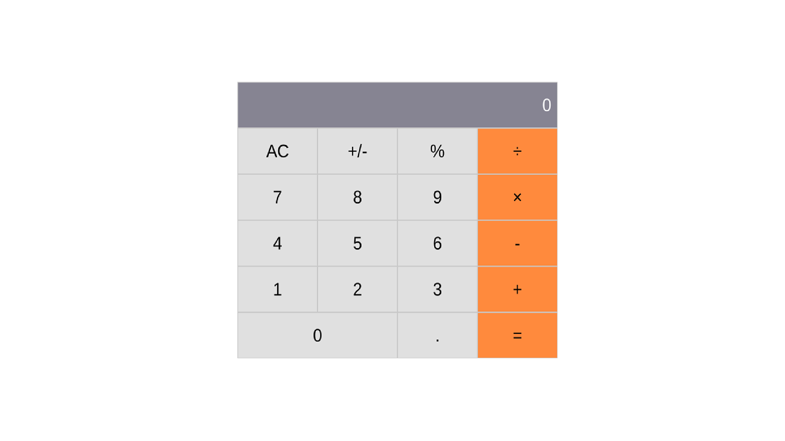

# Math magicians

> "Math magicians" is a website for all fans of mathematics. It is a Single Page App (SPA) that allows users to: Make simple calculations & Read a random math-related quote.

## Built With

- Major languages: JavaScript, HTML & CSS;
- Frameworks: React;
- Technologies used: GitHub, GitFlow, Terminal;

## Live Demo

[Live Demo Link](https://nicu-pop-math-magicians.netlify.app/)

## Getting Started

### Prerequisites

- Please make sure you have Node.js packedge installed on your terminal.

### Setup

To get a local copy up and running follow these simple steps.

To setup the Math Magicians project in your local, in the repo page:
click on code (dropdown list) > Download as ZIP;
or open terminal of path you want to install project and run this command  
`git clone https://github.com/nicupop729/Math-Magicians.git`.

### Install

Run in your terminal the following commands:

**`$ cd Math-Magicians/`** 
**`$ npm install`** 
**`$ npm start`**

## Author

👤 **Nicolae Pop**

- GitHub: [@nicupop729](https://github.com/nicupop729)
- Twitter: [@nicupop729](https://twitter.com/nicupop729)
- LinkedIn: [LinkedIn](https://www.linkedin.com/in/nicolae-pop/)

## 🤝 Contributing

Contributions, issues, and feature requests are welcome!

Feel free to check the [issues page](https://github.com/nicupop729/Math-Magicians/issues).

## Show your support

Give a ⭐️ if you like this project!

## Acknowledgments

This is a project done during React module at **[Microverse](https://www.microverse.org/)**, a remote web-developer school, using their support and frameworks provided.

## 📝 License

This project is [MIT](./MIT.md) licensed.
